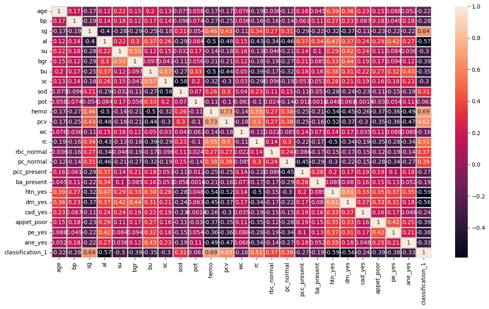
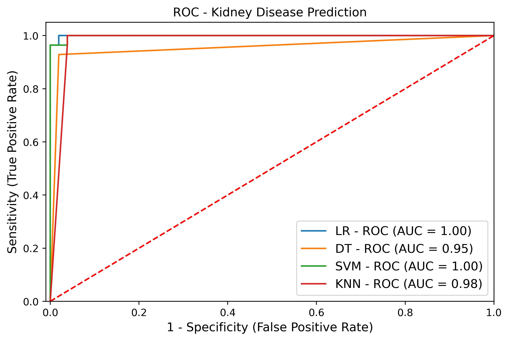

# 🩺 Kidney Disease Prediction using Machine Learning

This project aims to **predict Chronic Kidney Disease (CKD)** using multiple machine learning models. The pipeline includes **data preprocessing**, **EDA**, **feature analysis**, **model training**, and **performance evaluation** using ROC curves and AUC scores.

---

## 📂 Project Structure

```
├── kidney_disease.csv
├── kidney.pkl
├── roc_kidney.jpeg
├── correlation_features.png
├── notebook.ipynb  (if you have one)
└── README.md
```

---

## 📘 Project Overview

Chronic Kidney Disease (CKD) is a major global health issue. Early prediction allows for timely intervention and improved patient outcomes.
This project builds a predictive model using:

* Logistic Regression (LR)
* Decision Tree (DT)
* Support Vector Machine (SVM)
* K-Nearest Neighbors (KNN)

The dataset contains medical diagnostic attributes related to kidney function.

---

## 📊 Exploratory Data Analysis (EDA)

### 🔥 Correlation Heatmap

A correlation heatmap was created to observe relationships between features and the target variable.



### 🔍 Insights:

* Strong relationships found between **serum creatinine**, **blood urea**, **hemoglobin**, and the target.
* Weak correlations exist among many categorical-encoded features.

---

## 🤖 Machine Learning Models

The following ML models were trained and evaluated:

| Model               | AUC Score |
| ------------------- | --------- |
| Logistic Regression | **1.00**  |
| SVM                 | **1.00**  |
| KNN                 | **0.98**  |
| Decision Tree       | **0.95**  |

### ROC Curve Comparison



---

## 🛠️ Tech Stack

* **Python**
* **Pandas, NumPy**
* **Matplotlib, Seaborn**
* **Scikit-Learn**
* **Jupyter Notebook**

---

## ⚙️ Workflow

### 1️⃣ Data Loading

CSV loaded from `kidney_disease.csv`.

### 2️⃣ Data Preprocessing

✔ Handling missing values
✔ Label encoding
✔ Feature transformation
✔ Train-test split

### 3️⃣ Model Training

All four models were trained on the processed dataset.

### 4️⃣ Evaluation

Metrics used:

* ROC-AUC
* Accuracy
* Precision, Recall, F1-score

---

## 📈 Results Summary

* Logistic Regression & SVM performed the best with **AUC = 1.00**
* KNN performs well but slightly lower due to distance-based calculations.
* Decision Tree shows a bit of overfitting (AUC = 0.95).

---

## 🧪 How to Run the Project

```bash
git clone <your-repo-url>
cd kidney-disease-prediction
pip install -r requirements.txt
python app.py  # if using flask/streamlit script
```

Or open the `.ipynb` file in Jupyter Notebook.

---

## 📦 Dataset

The dataset is included as:

* `kidney_disease.csv`
* `kindey.pkl` (Prediction Model)

---

## 🌟 Future Improvements

* Add hyperparameter tuning
* Deploy model using Streamlit
* Add SHAP-based feature explainability
* Integrate Deep Learning models

---

## 🤝 Contributions

Feel free to raise issues or submit pull requests.

---

